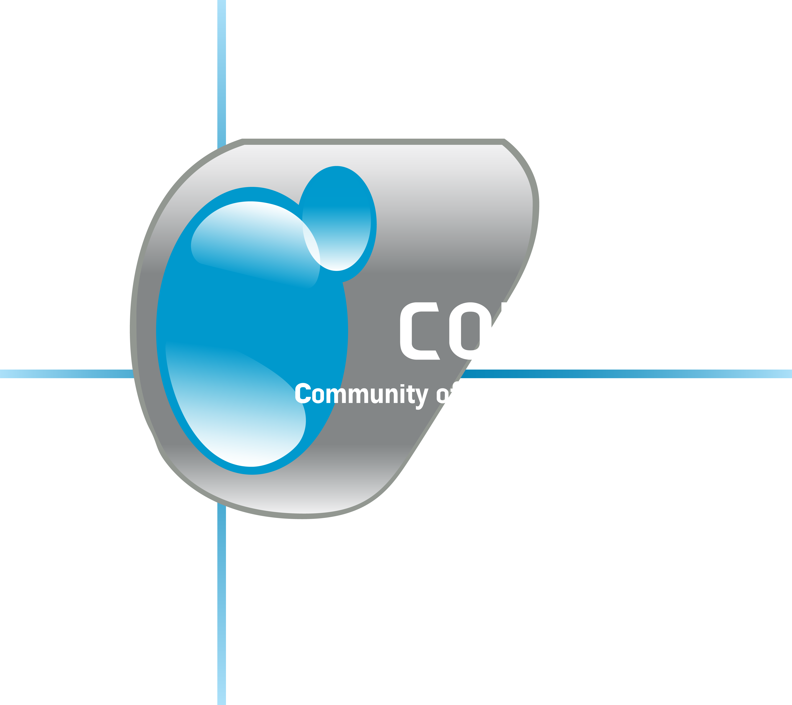

  

  
  
  
  
  

---

Profile organisasi dan sistem untuk mengelola organisasi COMIT (Community of Information Technology) berbasis website.

Dibangun menggunakan **Laravel** dan **React**, didesain elegan dan minimalist dengan **Tailwind CSS**.

### Fitur Utama

- Profil Organisisi, tampilan informasi lengkap tentang apa itu COMIT.
- Manajemen Keanggotaan, sistem pendaftaran anggota.
- Manajemen Keuangan, sistem mengelola dan memantau keuangan, dan laporan keuangan.
- Manajemen Kegiatan, sistem mengelola semua kegiatan, beserta absensi digital.

### License

Project ini menggunakan lisensi [MIT](./LICENSE)

### Support

Jika ada kendala atau butuh bantuan:

- Email: [comit.unipi@gmail.com](mailto:comit.unipi@gmail.com)
- Instagram: [@comit.ipem](https://www.instagram.com/comit.ipem/)
- Tiktok: [@comit_unipi](https://www.tiktok.com/@comit_unipi)
- Website: [comitunipi.com](https://comitunipi.com)
